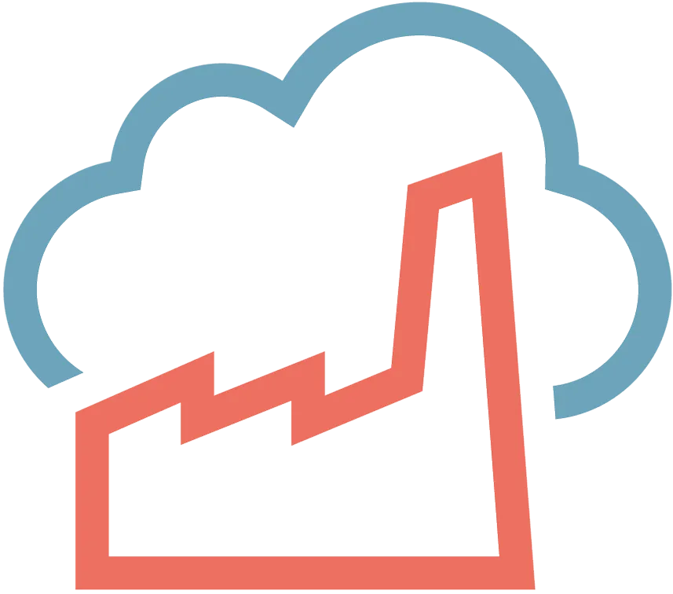

    
Vigh Zoltán - <b>Zool</b>

    
(CKA, CKAD, CKS, AWS Solution Architect/Sysops) 

[https://www.linkedin.com/in/zvigh/](https://www.linkedin.com/in/zvigh/)

[https://codefactory.hu/](https://codefactory.hu)

---

### Agenda

1.  [Container](./02-container.md)
2.  Microservices
3.  Kubernetes - I
4.  Kubernetes - II
