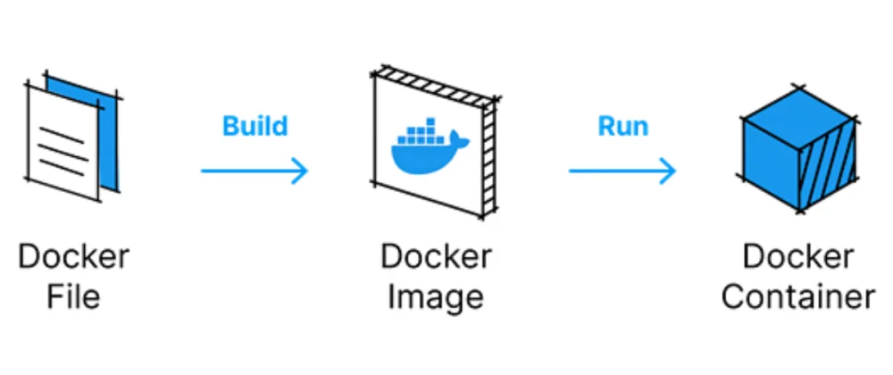

### What is Container?

- Standardized packaging for software and dependencies
- Isolate appfrom each other
- Share the same OS kernel
- Works for all major Linux distributions
- Container native to Windows Server 2016

---

### VM vs. Container


---
### Benefits of VM

- All OS resources available to apps
- Established management tools
- Established security tools
- Better known security controls

---
### Benefits of Container

- Reduced IT management resources
- Reduced size of snapshots
- Quicker spinning up apps
- Reduced & simplified security updates
- Less code to transfer, migrate, upload workloads

---
### Evolution of IT


---
### Using Docker


---
### Setting up your machine

<section style="text-align: left;">

**Requirements:**

- Docker Desktop or similar

```bash
docker run hello-world
```

</section>

---

### Writing your first Dockerfile
``` 
# A Dockerfile is a text document that contains all the 
# commands you could call on the command line to make an 
# image. Create a file hello.js and copy this code into it. 
# Here we wrote a simple JS code to show Hello World on 
# localhost:8888.
```

```nodejs
var http = require("http");

http.createServer(function (request, response) {
    response.writeHead(200, {'Content-Type': 'text/plain'});
    response.end('Hello World\n');
}).listen(8888);

// Console will print the message
console.log('Server running at http://127.0.0.1:8888/');

```

---

### Create a file named Dockerfile and copy this code into it.

```Dockerfile
FROM node:8 
LABEL maintainer="vigh.zoltan@codefactory.hu"
RUN npm install
ADD hello.js /hello.js
EXPOSE 8888
ENTRYPOINT [ "node", "hello.js" ]
```

---
### Building your Docker Images




```bash
docker build -t helloworld .
```

---

### Running the docker image

```bash
docker run -p 8888:8888 helloworld
```

---
### Understanding layers
<div style="width: 70%;">


</div>

```
# Note: Docker Images are immutable means Docker images can’t
# ever change. Once you’ve made one, you can delete it, but 
# you can’t modify it.
```
---
### Docker Commands - IMAGES
``` bash
# Build an Image from a Dockerfile
docker build -t <image_name>

# Build an Image from a Dockerfile without the cache
docker build -t <image_name> . –no-cache

# List local images
docker images

# Delete an Image
docker rmi <image_name>

# Remove all unused images
docker image prune 
```

--- 
### Docker Commands - CONTAINERS - I
``` bash
# Create and run a container from an image, with a custom name:
docker run --name <container_name> <image_name>

# Run a container with and publish a container’s port(s) to the host.
docker run -p <host_port>:<container_port> <image_name>

# Run a container in the background
docker run -d <image_name>

# Start or stop an existing container:
docker start|stop <container_name> (or <container-id>)

# Remove a stopped container:
docker rm <container_name>

```

--- 
### Docker Commands - CONTAINERS - II
```
# Open a shell inside a running container:
docker exec -it <container_name> sh

# Fetch and follow the logs of a container:
docker logs -f <container_name>

# To inspect a running container:
docker inspect <container_name> (or <container_id>)

# To list currently running containers:
docker ps

# List all docker containers (running and stopped):
docker ps --all

# View resource usage stats
docker container stats
```

---
### Docker Registries
- Docker Hub
- Azure Container Registry
- Google Container Registry
- Google Artifact Registry
- Amazon EC2 Container Registry
- Bintray.io/Artifactory
- Quay.io
- GitHub Container Registry

--- 


---
### Docker vs. K8s

