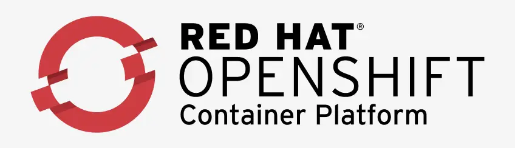

### PET Vs. Cattle 

---
### Kubernetes Alternatives

- Container as a Service (CaaS)
    - AWS ECS
    - Azure Container Instances
    - Google Cloud Run
---
AWS ECS is an integral part of Amazon's model of a cloud computing system.

---
Azure Container Services helps the developers to deploy containers on the Azure cloud and manage the underlying infrastructure. 

---
Google Cloud Run is a well-managed computer platform that enables developers to run containers with invocable requests or events.

---
- Managed Kubernetes Services
    - Google Kubernetes Engine
    - Amazon Elastic Kubernetes Services (EKS)
    - Azure Kubernetes Services

---
Google Kubernetes Engine helps in orchestrating and automating software development with scaling and management.

---
Amazon Kubernetes services are open-source software that allows the deployment and management of containers in clusters.

---
Azure Kubernetes Services is one of the quickest ways to start developing and deploying cloud-native apps that help build code to cloud pipelines and guidelines.

---
- PaaS Platforms
    - OpenShift Container Platform
    - Rancher
---
OpenShift Container Platform is a private platform for container managers.

---

---

---
Rancher is one of Kubernetes' competitors which is a complete software stack for teams that adopt containers.

---
- Lightweight Orchestrators
    - Docker Swarm
    - Nomad
    - DC/OS
---
A Docker Swarm is a combination of physical and virtual machines that run on the Docket application and join into a cluster.

---
Nomad is a simple and flexible scheduler or orchestration tool which helps in managing containers precisely in a much more compact manner.

