### Trends

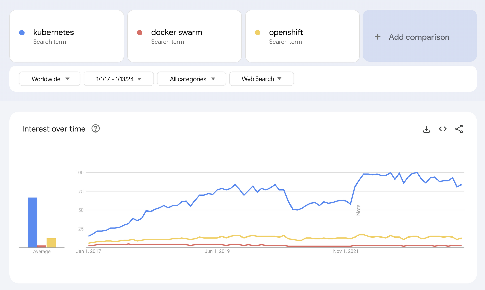

* * *

### CNCF

https://cncf.landscape2.io/

* * *

### JUST CI/CD....

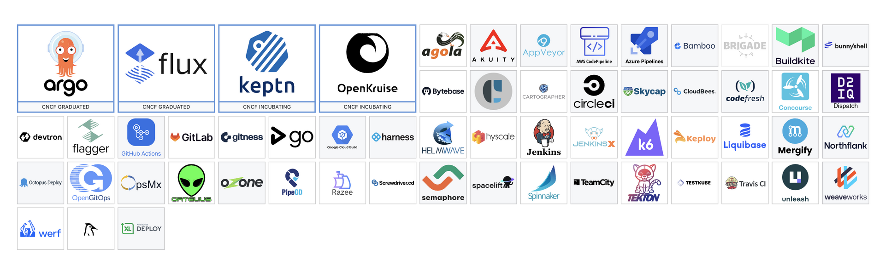

* * *

### Kubernetes Architecture


* * *

### API Server

- Every piece of information in K8s is an API Object
- Every API object has a UID and version
- REST CURD(create/update/read/delete)
- Alpha/Beta/Stable

* * *

### Install minikube

* * *

### kubectl

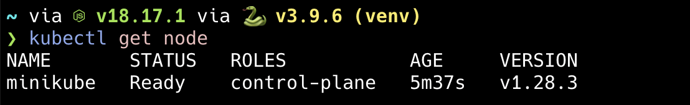

* * *

### kubernetes Dashboard - I

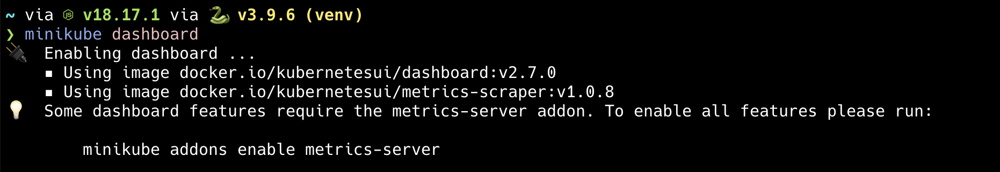

* * *

### kubernetes Dashboard - II

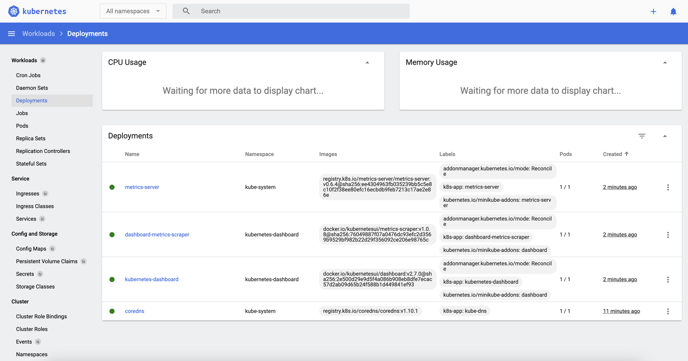

* * *

### ETCD - I

- CoreOS
- KV Storage
- Very reliable/Highly distributed
- Fast 10,000 write/s (8 vCPUs + 16GB Memory + 50GB SSD)

* * *

### ETCD - II

- Kubernetes API GRPC
- Kubernetes meta
- TLS + Encryption
- Etcdctl snapshot/backup/restore

* * *

### ETCD - communication

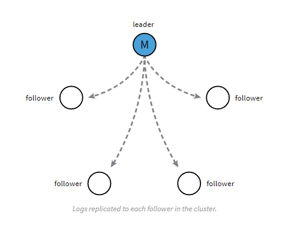

* * *

### ETCD - stacked

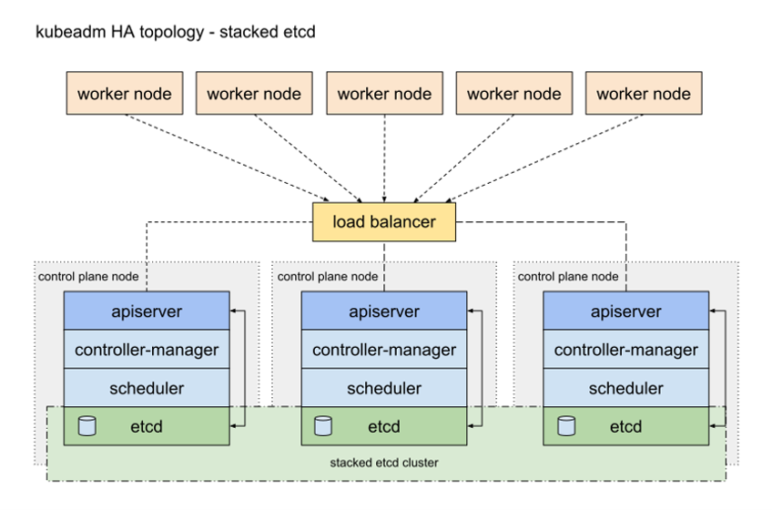

* * *

### ETCD - external

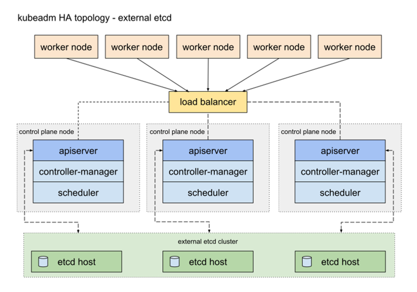

* * *

### Controller Manager

- Node Controller
- Endpoint Controller
- Service Account & Token Controller
- PersistentVolumeLabels controller

* * *

### kube-scheduler

- Responsible for scheduling POD on workers
- nodeSelector (disktype: ssd), affinity/anti-affinity
- Multiple implementations possible

* * *

### Kubelet

- Node Agent
- API -> PodSpec -> manage container

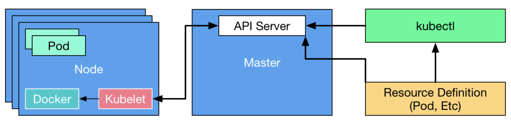

* * *

### Kubelet - Communication


* * *

### POD

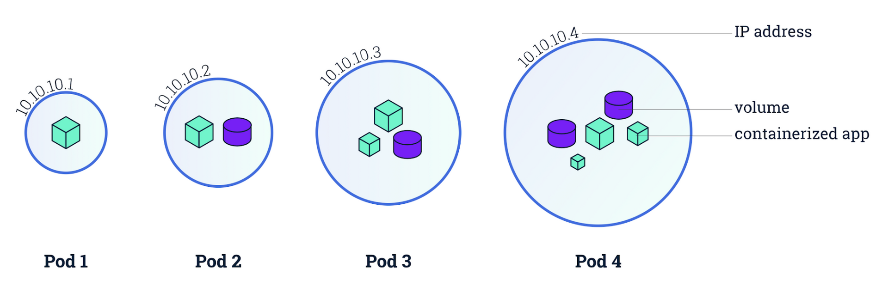

* * *

### POD definition

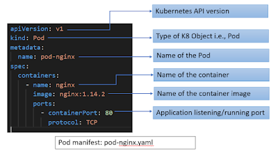

* * *

### POD Sidecar

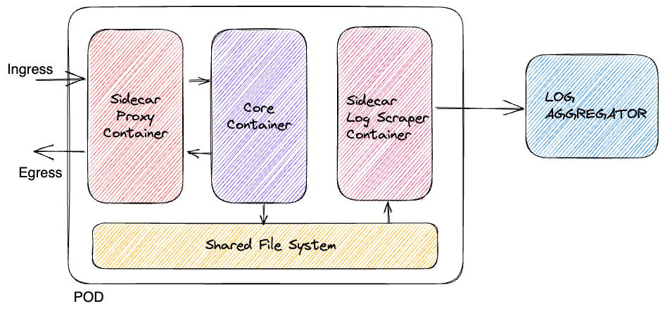

* * *

### POD Sidecar - Examplte

```yaml
apiVersion: apps/v1
kind: Deployment
metadata:
  name: log-app # Name of the deployment
spec:
  replicas: 1 # Number of replicas
  selector:
    matchLabels:
      app: log-app # Label selector for the pod
  template:
    metadata:
      labels:
        app: log-app # Label for the pod
    spec:
      volumes:
        - name: log-volume # Define a volume to store the logs
          emptyDir: {} # Use an emptyDir volume type
      containers:
        - name: log-generator # Main container
          image: busybox # Use the busybox image
          command: ["/bin/sh"] # Override the default command
          args: ["-c", "while true; do date >> /var/log/app.log; sleep 1; done"] # Run a shell script that generates logs every second
          volumeMounts:
            - name: log-volume # Mount the volume to the container
              mountPath: /var/log # Mount it to the log directory
        - name: log-reader # Sidecar container
          image: busybox # Use another busybox image
          command: ["/bin/sh"] # Override the default command
          args: ["-c", "tail -f /var/log/app.log"] # Run a shell script that tails the log file
          volumeMounts:
            - name: log-volume # Mount the same volume as the main container
              mountPath: /var/log # Mount it to the same directory in the sidecar container
```

* * *

### POD Init Container

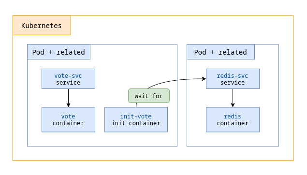

* * *

### POD HEALTH

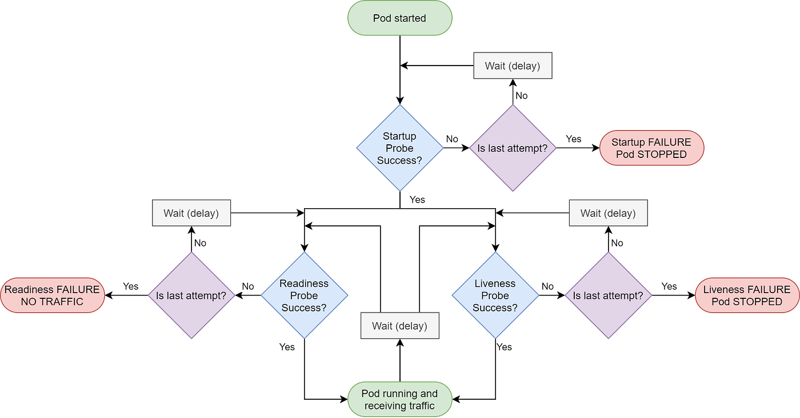


* * *

### POD - Startup Probes - I

```yaml
startupProbe:
  httpGet:
   path: /healthz
   port: 8080
 initialDelaySeconds: 3
 periodSeconds: 3
```

- Used to check if the application inside the Container has started

* * *

### POD - Liveness Probes - I

```yaml
livenessProbe:
  httpGet:
   path: /healthz
   port: 8080
  initialDelaySeconds: 3
  periodSeconds: 3
```

- Used to check if the container is available and alive.

* * *

### POD - Readiness Probes - II

```yaml
readinessProbe:
  httpGet:
   path: /healthz
   port: 8080
  initialDelaySeconds: 3
  periodSeconds: 3
```

- Used to check if the application is ready to use and serve the traffic.

* * *

### POD - Labels & Selectors

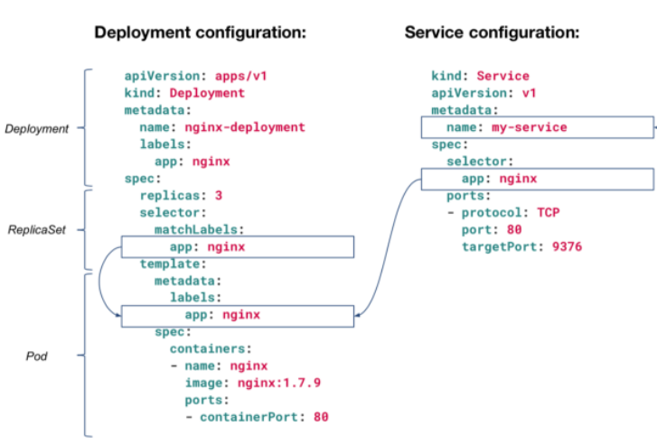

* * *

### POD - Search with labels (examples)

```bash
kubectl get pods --show-labels 
kubectl label pods myPod env=dev
kubectl get pods --selector env=dev
kubectl get pods -l 'env in (prod, dev)'
```

* * *

### POD - Other commands

- logs
- exec
- port-forward
- describe

* * *

### SERVICE

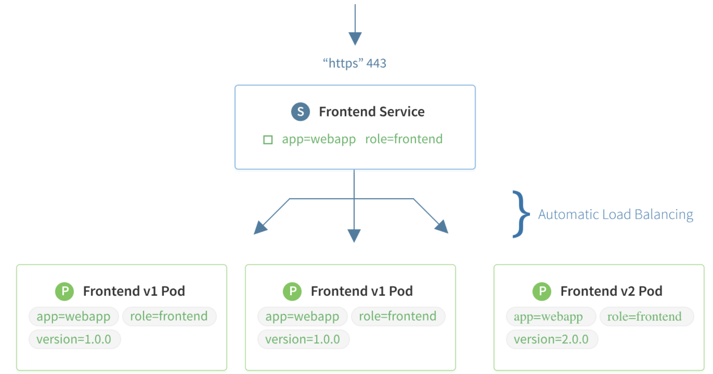

* * *

### Defining a Service

```yaml
apiVersion: v1
kind: Service
metadata:
  name: my-service
spec:
  selector:
    app.kubernetes.io/name: MyApp
  ports:
    - protocol: TCP
      port: 80
      targetPort: 9376
```

https://kubernetes.io/docs/concepts/services-networking/service/#defining-a-service

* * *

### Service types

- ClusterIP
- LoadBalancer
- Nodeport
- ExternalName

* * *

### kube-proxy

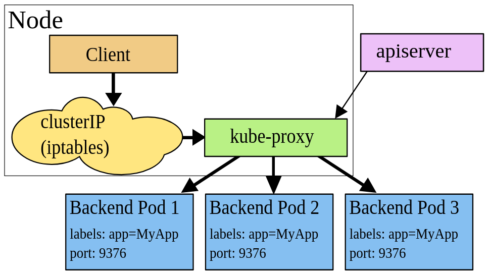

* * *