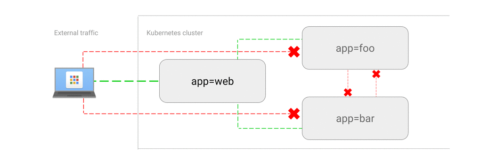

### Namespace

- User, Group separation
- Resource Quotas

* * *

### Namespace - Resource Quota

```yaml
apiVersion: v1
kind: ResourceQuota
metadata:
    name: compute-resources
spec:
    hard:
        requests.cpu: "1"
        requests.memory: 1Gi
        limits.cpu: "2"
        limits.memory: 2Gi
        requests.nvidia.com/gpu: 4
```

* * *

### POD - Resource

```yaml
apiVersion: v1
kind: Pod
metadata:
    name: high-priority
spec:
    containers:
    - name: high-priority
        image: ubuntu
        command: ["/bin/sh"]
        args: ["-c", "while true; do echo hello; sleep 10;done"]
        resources:
            requests:
                memory: "10Gi"
                cpu: "500m"
            limits:
                memory: "10Gi"
                cpu: "500m"
    priorityClassName: high
```

https://kubernetes.io/docs/concepts/policy/resource-quotas/

* * *

### Secrets & Configmap

https://kubernetes.io/docs/concepts/configuration/secret/

* * *

### Disk And Storage Management

https://kubernetes.io/docs/concepts/storage/

- emptydir
- hostPath
- NFS
- Public Cloud Volumes

* * *

### Local Dev ENV

- Minikube
- Docker Desktop
- Kind
- K3S

* * *

### Networking

https://kubernetes.io/docs/concepts/cluster-administration/networking/


* * *

### K8s CNI

https://kubernetes.io/docs/concepts/cluster-administration/addons/#networking-and-network-policy


* * *

### Deployment & Replicaset - Release

```bash
kubectl create -f https://k8s.io/examples/controllers/nginx-deployment.yaml
```

* * *

### Deployment & Replicaset - Roll back

```
kubectl set image deployment.v1.apps/nginx-deployment nginx=nginx:1.91 --record=true
kubectl rollout status deployment.v1.apps/nginx-deployment
kubectl rollout history deployment.v1.apps/nginx-deployment
kubectl rollout undo deployment.v1.apps/nginx-deployment
```

* * *

### Deployment & Replicaset - Scale up /down

```
kubectl scale deployment.v1.apps/nginx-deployment --replicas=10
```

* * *

### Horizontal & Vertical AutoScaling


* * *

### Daemonset

https://kubernetes.io/docs/concepts/workloads/controllers/daemonset/

* * *

### Batch Job

https://kubernetes.io/docs/concepts/workloads/controllers/job/

* * *

### Job

https://kubernetes.io/docs/concepts/workloads/controllers/cron-jobs/

* * *

### Node Drain & Cordon

https://kubernetes.io/docs/tasks/administer-cluster/safely-drain-node/

* * *

### Operator

https://kubernetes.io/docs/concepts/extend-kubernetes/operator/

* * *

### Kubernetes install tools

Open Source

- kubeadm
- Kubespray
- kubicorn
- Kops

* * *

### Tools (Krew)

- Access-matrix
- Tree
- Ssh-jump
- Kubectx
- kubens

* * *

### Tools - STERN

- stern pod-query
- stern frontend --selector release=canary
- stern auth -t --since 15m

* * *

### Tools - BenchMark & Cluster Validation

- Kube-bench
- Sonobuoy
- Certified Kubernetes offerings

* * *

### Security

Kernel isolation

- RKT
- Gvisor - https://gvisor.dev/
- CRI-O - https://github.com/cri-o/cri-o

https://landscape.cncf.io/guide#runtime--container-runtime

* * *

### NetworkPolicy

https://github.com/ahmetb/kubernetes-network-policy-recipes/tree/master

* * *

### DENY all traffic to an application

Use Cases:

- It’s very common: To start whitelisting the traffic using Network Policies, first you need to blacklist the traffic using this policy.
- You want to run a Pod and want to prevent any other Pods communicating with it.
- You temporarily want to isolate traffic to a Service from other Pods.


### Example

Run a nginx Pod with labels `app=web` and expose it at port 80:

```
kubectl run web --image=nginx --labels="app=web" --expose --port=80
```

Run a temporary Pod and make a request to `web` Service:

```
$ kubectl run --rm -i -t --image=alpine test-$RANDOM -- sh
/ # wget -qO- http://web
<!DOCTYPE html>
<html>
<head>
...
```

It works, now save the following manifest to `web-deny-all.yaml`,  
then apply to the cluster:

```yaml
kind: NetworkPolicy
apiVersion: networking.k8s.io/v1
metadata:
    name: web-deny-all
spec:
    podSelector:
        matchLabels:
            app: web
    ingress: []
```

```sh
$ kubectl apply -f web-deny-all.yaml
networkpolicy "web-deny-all" created
```

## Try it out

Run a test Pod again, and try to query web:

```
$ kubectl run --rm -i -t --image=alpine test-$RANDOM -- sh
/ # wget -qO- --timeout=2 http://web
wget: download timed out
```

Traffic dropped!

* * *

### ALLOW traffic from external clients



### Example

Run a web server and expose it to the internet with a Load Balancer:

```sh
kubectl run web --image=nginx --labels="app=web" --port=80

kubectl expose pod/web --type=LoadBalancer
```

Wait until an EXTERNAL-IP appears on `kubectl get service` output. Visit the  
`http://[EXTERNAL-IP]` on your browser and verify it is accessible.

The following manifest allows traffic from all sources (both internal from the  
cluster and external). Save it to `web-allow-external.yaml` and apply to the  
cluster:

```yaml
kind: NetworkPolicy
apiVersion: networking.k8s.io/v1
metadata:
    name: web-allow-external
spec:
    podSelector:
        matchLabels:
            app: web
    ingress:
    - {}
```

```sh
$ kubectl apply -f web-allow-external.yaml
networkpolicy "web-allow-external" created
```

Visit the `http://[EXTERNAL-IP]` on your browser again and verify it still  
works.

### Remarks

This manifest specifies one ingress rule for the `app=web` pods. Since it does  
not specify a particular `podSelector` or `namespaceSelector`, it allows traffic  
from all resources, including external.

To restrict external access only to port 80, you can deploy an ingress rule  
such as:

```yaml
    ingress:
    - ports:
        - port: 80
```